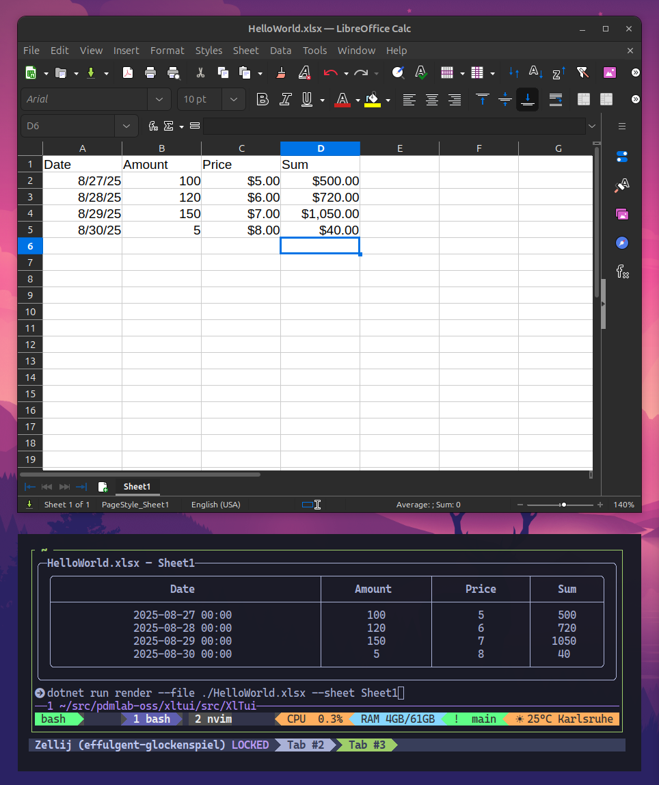
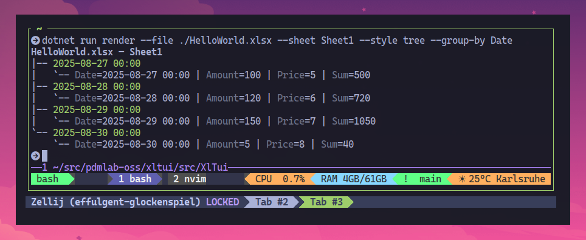

# xltui - minimal Terminal UI for Excel files

Minimal Excel Terminal UI (TUI) inspired by TUIs like

* [doxx](https://github.com/bgreenwell/doxx)
* [lazysql](https://github.com/jorgerojas26/lazysql)

## Status

This is the very beginning of this little project. Right now it's more of a CLI to explore some ideas and concepts.

What you can do already:

Open a `.xslx` file and render a particular sheet as a table.



Open a `.xlsx` file and render it as a tree.



More options:

```bash
xltui render --file sample.xlsx
xltui render --file sample.xlsx --sheet People --style table
xltui render --file sample.xlsx --sheet People --style tree --group-by Department
xltui render --file sample.xlsx --sheet-index 1 --columns Name,Email,Dept
xltui render --file sample.xlsx --json
xltui render --file sample.xslx --json --columns Name,Email
```

The `--json` option can be useful if you want to process the data e.g. using `jq`:

```bash
# this will export a single column "Amount" and jq will transform the array to an array of strings:
xltui render --file HelloWorld.xlsx --json --columns Amount | jq -c '[ .[] | .[] | to_entries[] | (.value // "") | tostring ]' 
```

## Installing

You can download the binaries from the [Releases](https://github.com/PDMLab/xltui/releases) or you can get the `.deb` files from [here](https://github.com/dariogriffo/xltui-debian/releases). Thank you [@dariogriffo](https://github.com/dariogriffo) for creating and hosting the debs!

### Installing / updating on Ubuntu

```bash
json=$(curl -s https://api.github.com/repos/PDMLab/xltui/releases/latest) && tag=$(echo "$json" | grep -m1 '"tag_name":' | cut -d '"' -f4) && echo "Installing xltui $tag..." && url=$(echo "$json" | grep "browser_download_url" | grep "linux-x64.*tar.gz" | cut -d '"' -f4) && [ -n "$url" ] && curl -L "$url" | tar -xz && mkdir -p ~/.local/bin && mv xltui ~/.local/bin/ && echo "xltui $tag installed to ~/.local/bin"
```

### Installling on Debian

Follow the instructions to add the repository on [https://debian.griffo.io](https://debian.griffo.io), then run:

```bash
sudo apt update
sudo apt install xltui
```
